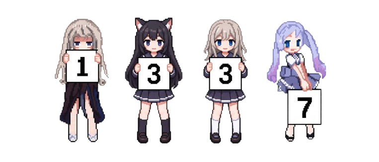

<div align="left">

# Exist



`low-level skid • Paste God since 1993`
</div>

---

## about

```txt
name      : Exist ud
location  : wyoming, us
focus     : skidding
```


---

## environment

<p align="left">
  
</p>

```txt
main machine : windows 11
```

---

## stack

<p align="left">
  <a href="https://antigravity.google/">
    
  </a>
  <b> Antigravity</b>
  &nbsp;&nbsp;

  <a href="https://www.anthropic.com/">
    
  </a>
  <b> Claude</b>
  &nbsp;&nbsp;

  <a href="https://openai.com/codex/">
    
  </a>
  <b> Codex</b>
</p>


```txt
systems   : windows 11
focus     : skidding, vibecoding
tools     : automation, ai agents
```

